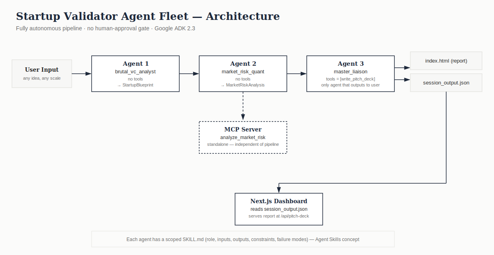

# Startup Validator Agent Fleet (Google ADK Engine)

A multi-agent business-idea validator built for the Kaggle Generative AI Intensive Capstone (Agents for Business track). Feed it a raw startup idea — any industry, scale, or location — and it returns a structured, investor-ready critique: market sizing, risk assessment, and an honest verdict, generated entirely autonomously by three chained Google ADK agents.

## Problem

Thousands of informal startup ideas are pitched to incubators and investors every year, and manually evaluating each one for market size, competitive reality, and basic viability is slow and inconsistent. This project automates a first, rigorous pass.

## Solution

Three specialized agents run in sequence: one evaluates the raw idea into a structured blueprint, one quantifies market sizing and risk, and one synthesizes a final verdict and writes an investor-facing HTML report. The whole pipeline runs unattended — no approval step, no human in the loop — from idea in to report out.

## Why Agents, Not One LLM Call

- **Separation of concerns** — a skeptical evaluator and a quantitative analyst need different reasoning styles; splitting them keeps each output sharper.
- **Deterministic data** — every handoff is a strict Pydantic v2 schema, not free text.
- **Scoped tool access** — only one agent can write files, enforced and audited, not just assumed.

## Architecture



`Raw idea → Agent 1 (brutal_vc_analyst) → Agent 2 (market_risk_quant) → Agent 3 (master_liaison) → index.html + session_output.json`. Agent 2's market-sizing logic is also independently exposed as a standalone MCP server — a separate, parallel capability, not a dependency inside the main pipeline.

### Course Concepts Demonstrated

| Concept | Where |
|---|---|
| Agent / Multi-agent system (ADK) | `agents.py`, `main.py` |
| MCP Server | `mcp_server.py`, `scratch/test_mcp_client.py` |
| Agent Skills | `skills/brutal_vc_analyst.SKILL.md`, `skills/market_risk_quant.SKILL.md`, `skills/master_liaison.SKILL.md` |
| Security features | `.env`-only secrets; tool isolation verified by `scratch/audit_tool_registration.py` (see below) |
| Antigravity | Used for initial architecture and Day 1 prototype — see submission video |
| Deployability | Fully env-var-driven configuration, no hardcoded paths or secrets — see submission video |

## Project Structure

```
startup-idea-validator/
├── schemas.py
├── tools.py
├── agents.py
├── main.py
├── mcp_server.py
├── skills/
│   ├── brutal_vc_analyst.SKILL.md
│   ├── market_risk_quant.SKILL.md
│   └── master_liaison.SKILL.md
├── scratch/
│   ├── audit_tool_registration.py
│   └── test_mcp_client.py
├── fixtures/
│   ├── sample_index.html
│   └── sample_session_output.json
├── dashboard/                  (Next.js App Router)
│   └── app/
│       ├── page.tsx
│       ├── globals.css
│       └── api/pitch-deck/route.ts
├── architecture-diagram.svg
├── .env.example
├── requirements.txt
└── README.md
```

> Confirm this matches your actual repo (`git ls-files`) before submitting — copy-paste this tree at your own risk if any file names have drifted.

## Setup

**Prerequisites:** Python 3.10+, Node 18+, a Gemini API key.

```bash
git clone <your-repo-url>
cd startup-idea-validator
python -m venv venv
source venv/bin/activate        # Windows: .\venv\Scripts\activate
pip install -r requirements.txt
cp .env.example .env            # then add your GEMINI_API_KEY
```

## Running the Pipeline

```bash
python main.py
```

- Press **Enter** with no input → loads a cached sample report instantly, zero API calls.
- Type **any idea** — any industry, scale, or location — runs the full live pipeline and generates a fresh `index.html` and `session_output.json`.

## Running the Dashboard

```bash
cd dashboard
npm install
npm run dev
```

Reads `session_output.json` and renders the blueprint, market/risk data, and the final report. Serves the raw generated report at `/api/pitch-deck`.

## Running & Testing the MCP Server

```bash
python mcp_server.py
```

To verify it actually responds correctly — not just that it starts:

```bash
python scratch/test_mcp_client.py
```

This calls `analyze_market_risk` directly and checks the response against the `MarketRiskAnalysis` schema.

## Verifying Tool Isolation

```bash
python scratch/audit_tool_registration.py
```

Confirms Agents 1 and 2 have zero tools, and Agent 3 has exactly `write_pitch_deck` — nothing more.

## Security & Tool Permissions

| Agent | Tools | Access scope |
|---|---|---|
| `brutal_vc_analyst` (Agent 1) | none | read-only context processing |
| `market_risk_quant` (Agent 2) | none | computes sizing/risk directly, no external dependency |
| `master_liaison` (Agent 3) | `write_pitch_deck` | the only agent with file-write access |

State validation is enforced by Pydantic v2 at every agent handoff — malformed data (wrong type, wrong list length) is rejected before it can propagate downstream. All secrets are read from `.env` and are never hardcoded or committed; see `.env.example` for the required variable.

## Design Decisions

- **Fully autonomous, no approval gate** — a deliberate choice, not a missing feature. The rubric requires at least three demonstrated concepts; this build demonstrates five without needing a blocking human step.
- **Local JSON instead of a database** — this is a single-process demo where nothing needs to survive a restart or cross a process boundary; a database would have added a moving part without adding a benefit.
- **Fixed template for report rendering** — the HTML layout stays deterministic regardless of what any individual generation produces, so design stays consistent across runs; only the data and the verdict change.

## Known Limitations / Future Work

- Not deployed to a live public endpoint (not required by the rubric) — the environment-variable-driven design would make containerized deployment (e.g., Cloud Run for the pipeline, Vercel for the dashboard) a small step, not a rearchitecture.
- Market sizing and risk scoring are LLM-estimated, not grounded in a live external data source — a natural next step would be wiring the MCP server to real market-data APIs.
- Single-idea, single-session runs — no history or comparison across multiple validated ideas yet.
